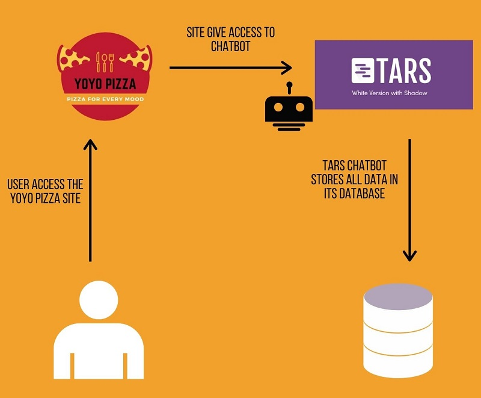

# YOYO_PIZZAS

**WORKFLOW OF THE PROJECT**

**PLACING AN ORDER**

        a)  User goes to the site.
        b)  The user interacts with the bot.
        c)  The bot takes the pizza order according to the menu and options provided using tars.
        d)  After the user provides name, contact number and is sent to Tars server with all details.
        e)  All the details are saved in the database.

